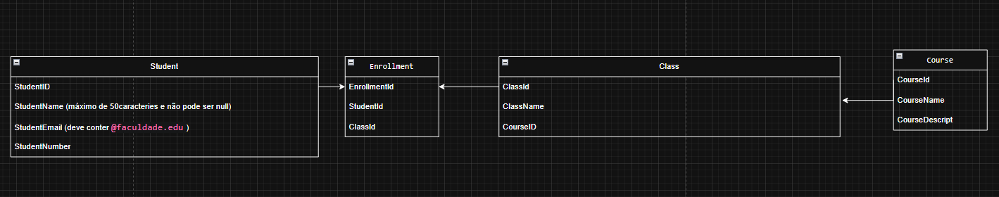
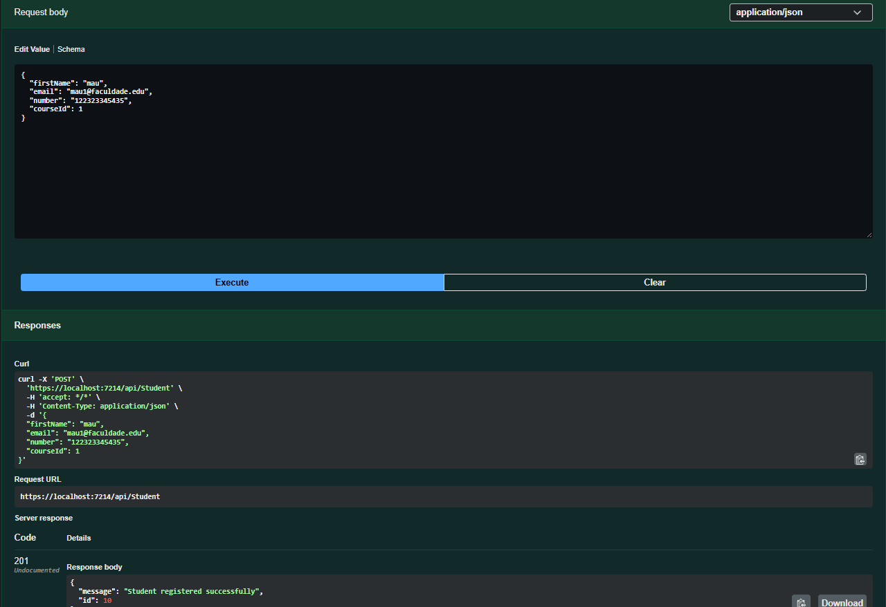
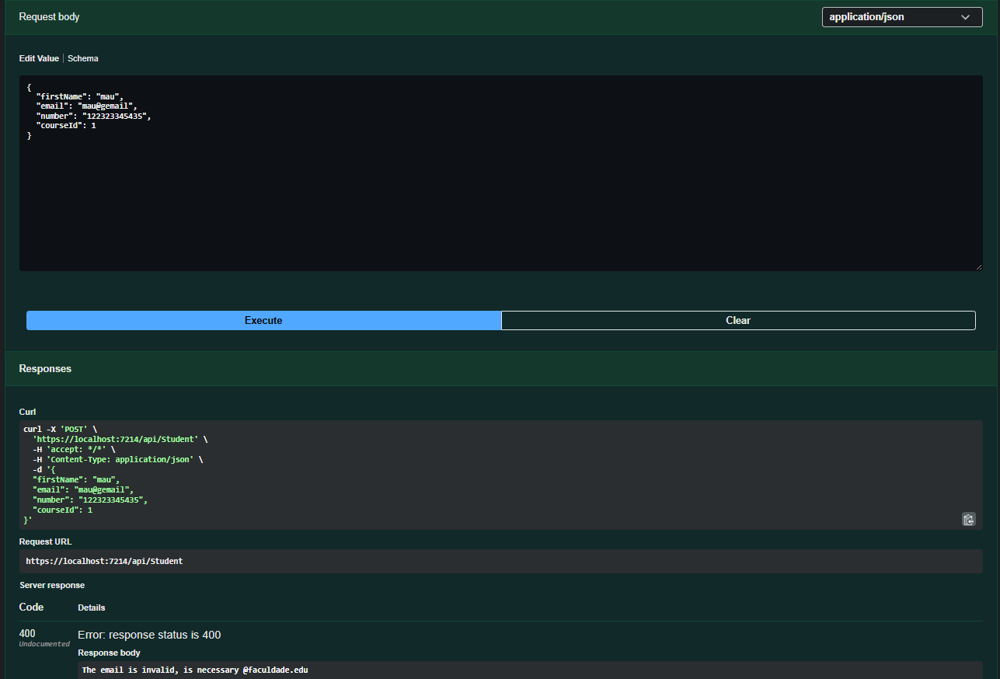
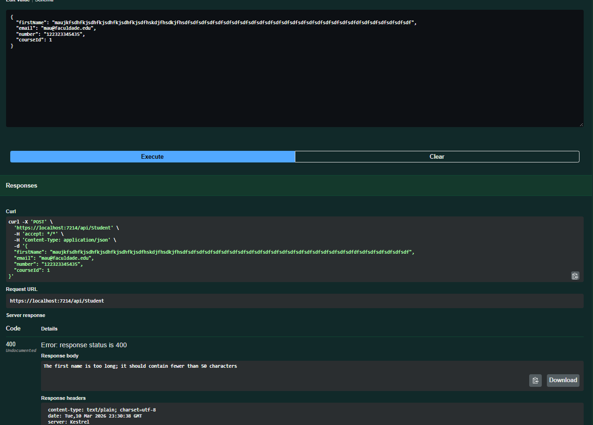
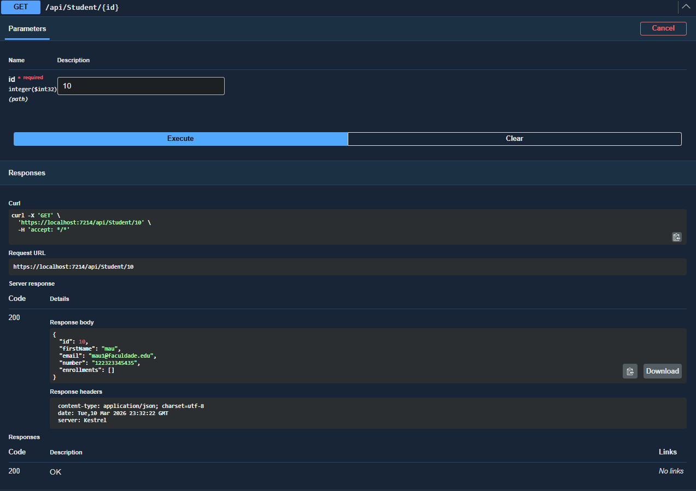
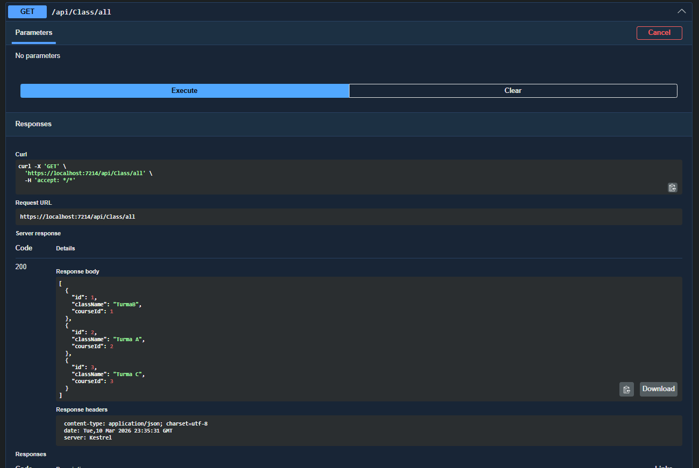
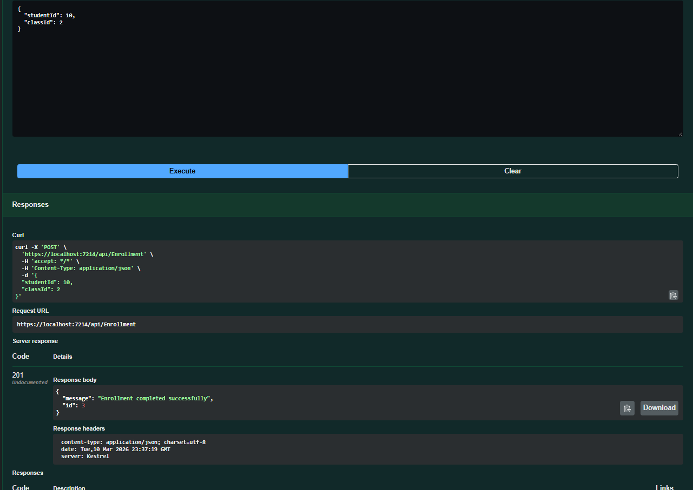
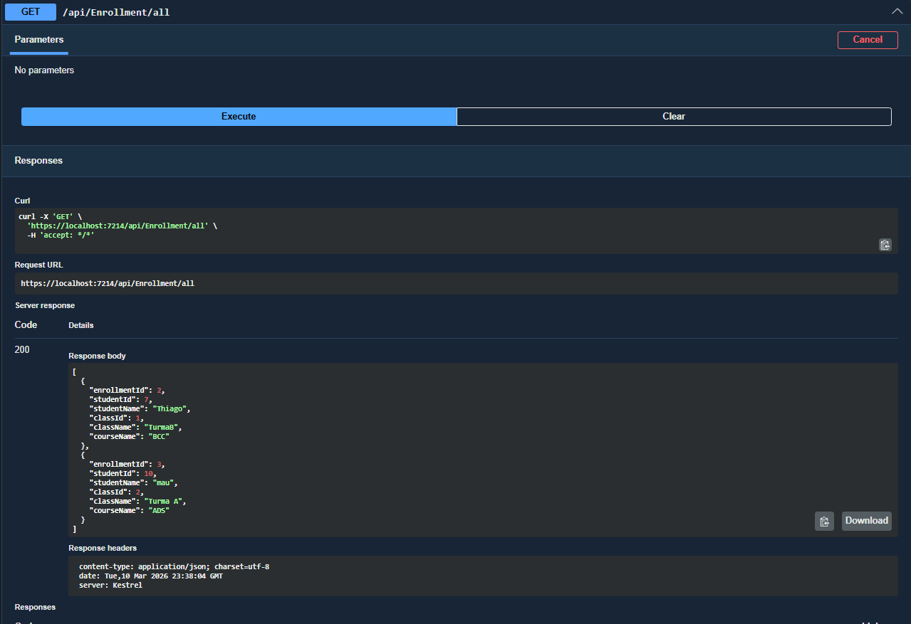
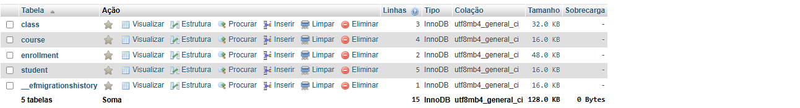

University Management System - Hexagonal Architecture
========================================================

Este projeto consiste numa API robusta para o gestão de uma estrutura universitária (Alunos, Cursos, Turmas e Matrículas), desenvolvida com **ASP.NET Core 8** e **Entity Framework Core**.

O foco principal foi a implementação do padrão **Ports and Adapters (Arquitetura Hexagonal)**, garantindo que o núcleo da aplicação (regras de negócio) esteja totalmente isolado de tecnologias externas como bases de dados e interfaces web.

Decisão de Escopo e Qualidade
--------------------------------

No início do desenvolvimento, o planeamento previa uma base de dados completa. porém, decidi  focar no **"Básico Bem Feito"**. Em vez de entregar muitas tabelas com lógica rasa, entreguei um _core_ de 4 entidades.
(Perdão professor, deveria ter feito algo mais simples, porém com isso "peguei melhor o jeito".)

Rotas e Endpoints (Swagger)
-------------------------------

A API está documentada e pode ser testada via Swagger, segue abaixo algumas das principais rotas:

### Students

*   GET /api/Student/all - Lista todos os alunos matriculados.
    
*   POST /api/Student - Realiza a matrícula validando as regras de negócio. Retorna o ID gerado.
    

### Courses

*   GET /api/Course/all - Lista todos os cursos disponíveis.
    
*   POST /api/Course - Cria um novo curso no sistema.
    

### Classes (Turmas)

*   POST /api/Class - Cria uma turma vinculada a um curso.
    
*   GET /api/Class/all - Lista turmas com os dados dos cursos relacionados.
    

### Enrollments (Matrículas em Turmas)

*   POST /api/Enrollment - Vincula um aluno a uma turma específica.
    
*   GET /api/Enrollment/all - Relatório completo mostrando Aluno, Turma e Curso.

Diagrama Base
-----------------------

    

Evidências de Testes
-----------------------

Espaço reservado para as capturas de tela dos testes realizados:

### 1. Registo de Aluno (POST) com Retorno de ID

### 2. Validação de Regra de Negócio (Erro de E-mail)

### 3. Validação de Regra de Negócio (Erro de Caracter)

### 4. Get All Students (Dados relacionados populados)

### 5. get All Classes (Dados relacionados populados)

### 6. Post Enrollment (Vinculação de Aluno a Turma)

### 7. Get All Enrollments (Dados relacionados populados)

### 8. DataBase 

Como rodar o projeto
------------------------

  Clonar o repositório.
    
2.  Configurar a _String_ de Conexão no appsettings.json.
    
3.  Executar Update-Database na Consola do Gestor de Pacotes.
    
4.  Iniciar a aplicação (dar o Play).
    

**Desenvolvido por Vinicius A Santana.**